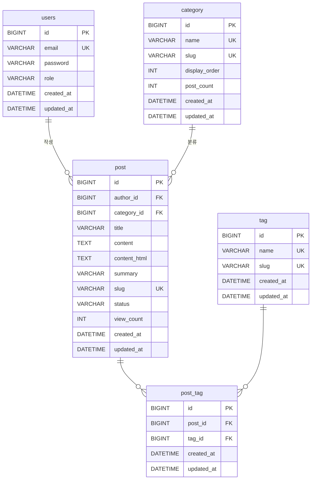

# Blog Project

개인 블로그 프로젝트입니다. Spring Boot 기반의 풀스택 웹 애플리케이션으로, 직접 설계하고 구현했습니다.

**[hgkimer.me](https://hgkimer.me)** 에서 확인하실 수 있습니다.

---

## Tech Stack

| 분류                  | 기술                                                     |
|---------------------|--------------------------------------------------------|
| **Language**        | Java 17                                                |
| **Framework**       | Spring Boot 3.5, Spring Security, Spring Data JPA      |
| **Template**        | Thymeleaf                                              |
| **Database**        | MySQL 8.0, Redis                                       |
| **ORM / Migration** | Hibernate, Flyway                                      |
| **Authentication**  | JWT (jjwt), Token Rotation, Blacklist                  |
| **Markdown**        | Flexmark                                               |
| **Build**           | Gradle (Kotlin DSL)                                    |
| **Infra**           | Docker, Docker Compose, Nginx, Certbot (Let's Encrypt) |

---

## 주요 기능

### 블로그

- 게시글 작성 / 수정 / 삭제 (Markdown 지원)
- 카테고리 및 태그 분류
- 게시글 상태 관리 (임시저장 / 발행)
- 조회수 카운트
- 키워드 검색 및 카테고리 필터링 (페이지네이션)

### 인증 / 보안

- JWT 기반 인증 (Access Token + Refresh Token)
- **Refresh Token Rotation** — 토큰 재발급 시 기존 토큰 무효화
- **Redis 기반 토큰 블랙리스트** — 로그아웃 시 즉시 무효화
- 로그인 엔드포인트 **Rate Limiting** (Nginx, Brute-Force 방어)
- HTTPS 적용 (Certbot / Let's Encrypt)
- HttpOnly + Secure 쿠키로 토큰 전달

### 인프라

- Docker Compose로 앱 + MySQL + 볼륨 통합 관리
- Nginx 리버스 프록시
- Flyway로 DB 스키마 버전 관리

---

## 아키텍처

```
Client
  │
  ▼
Nginx (443/80 → HTTPS, Rate Limit)
  │
  ▼
Spring Boot App (8080)
  ├── Controller Layer    — REST API / View Controller
  ├── Service Layer       — 비즈니스 로직
  ├── Repository Layer    — Spring Data JPA
  └── Security Layer      — JWT Filter, UserDetailsService
        │
        ├── MySQL          — 게시글, 카테고리, 태그, 유저
        └── Redis          — Refresh Token 저장 / Blacklist
```

---

## ERD



---

## 프로젝트 구조

```
private_blog/
├── src/main/java/.../
│   ├── config/            # Spring 설정 (Security, JPA, Markdown 등)
│   ├── domain/entity/     # JPA 엔티티 (Post, Category, Tag, User)
│   ├── persistence/jpa/   # Repository 인터페이스
│   ├── service/           # 비즈니스 로직
│   │   └── auth/          # JWT 발급 / 로테이션 / 블랙리스트
│   ├── security/          # JWT Filter, TokenProvider
│   └── web/
│       ├── controller/    # REST API + Thymeleaf View Controller
│       ├── dto/           # Request / Response DTO
│       └── exception/     # 전역 예외 처리
├── src/main/resources/
│   ├── db/migration/      # Flyway SQL 마이그레이션
│   ├── templates/         # Thymeleaf HTML 템플릿
│   └── static/            # CSS, 이미지
├── docker/
│   ├── Dockerfile
│   └── docker-compose.yaml
└── nginx/
    ├── hgkimer.me.conf    # nginx 설정
    └── bad_uri.conf       # 차단 uri 설정
```

---

## 실행 방법

### 1) 로컬 개발 실행 (local profile)

사전 요구사항:

- Java 17

실행:

```bash
./gradlew bootRun
```

`bootRun`은 기본적으로 `application-local.yaml` 프로파일로 실행됩니다.

### 2) Docker Compose 실행 (prod profile)

사전 요구사항:

- Java 17
- Docker & Docker Compose

실행:

```bash
# 1. 실행 가능한 JAR 생성 (build/libs/app.jar)
./gradlew bootJar

# 2. Docker 빌드 컨텍스트(docker/)로 JAR 복사
cp build/libs/app.jar docker/app.jar

# 3. 환경 변수 파일 준비
cp docker/example.env docker/.env.prod
# 필요 값 입력: DB_URL, DB_USER, DB_PASSWORD, MYSQL_ROOT_PASSWORD, MYSQL_DATABASE,
#            MYSQL_USER, MYSQL_PASSWORD, JWT_SECRET_KEY, REDIS_HOST, REDIS_PORT

# 4. 컨테이너 빌드/실행
cd docker
docker compose up -d --build
```

중지:

```bash
cd docker
docker compose down
```

---

## 구현 시 고민한 점

> private_blog 프로젝트를 구현하면서 기술적으로 고민했던 의사결정 포인트를 정리한 문서입니다.

---

## 1. 인증 / 보안

### 1.1 JWT 기반 인증에서 로그아웃을 즉시 반영하는 방법

**고민한 상황**

JWT는 서버가 상태를 보관하지 않는 stateless 구조이기 때문에, 한 번 발급된 토큰은 만료 전까지 서버가 취소할 수 없습니다. 쿠키를 삭제하더라도 토큰 자체가 유효한
상태라면 탈취된 경우 계속 사용될 수 있다는 문제가 있었습니다.

**선택한 방법**

- 각 토큰에 고유 식별자(`jti`, JWT ID)를 UUID로 부여
- 로그아웃 시 해당 `access token`의 `jti`를 Redis 블랙리스트에 저장하고, TTL을 토큰의 잔여 만료 시간과 일치시킴
- 인증 필터에서 토큰 검증 시 블랙리스트 여부를 함께 확인

**이유 / 트레이드오프**

Redis에 상태를 저장하므로 완전한 stateless는 아니지만, 로그아웃 즉시 반영과 탈취 대응을 위해서는 어느 정도의 서버 상태가 불가피하다고 판단했습니다. TTL을 토큰
잔여 수명에 맞추어 블랙리스트가 무한히 쌓이지 않도록 했습니다.

---

### 1.2 Refresh Token Rotation — 재사용 감지 설계

**고민한 상황**

`refresh token`을 오래 유지하면 탈취 시 장기 세션 하이재킹으로 이어질 수 있습니다. 단순히 "만료 전이면 재발급"하는 방식으로는 이를 막기 어렵습니다.

**선택한 방법**

- `refresh token` 발급 시 Redis에 사용자 키로 저장 (기존 토큰 덮어쓰기)
- 재발급 요청 시 클라이언트가 보낸 토큰과 Redis에 저장된 토큰이 일치하는지 먼저 확인
- 불일치 시 "이미 다른 토큰으로 교체되었거나 탈취 가능성이 있다"고 보고 Redis에서 토큰을 삭제하고 재발급 거부

**이유 / 트레이드오프**

재발급 로직을 단순한 "만료 연장"이 아닌 "재사용 감지" 관점으로 설계했습니다. 이전 `refresh token`이 다시 사용되면 토큰이 탈취되었다는 신호로 보고 세션 전체를
무효화합니다. 단, 동시에 여러 기기에서 로그인하는 경우 의도치 않은 세션 종료가 발생할 수 있다는 트레이드오프가 있습니다.

---

### 1.3 서버 자동 인증 복구 범위를 어디까지 허용할 것인가

**고민한 상황**

`access token`이 만료된 상태에서 사용자가 블로그 글 목록 페이지(`/posts`)에 접근한다고 가정합니다. 이때 서버가 자동으로 `refresh token`을 이용해
새 `access token`을 발급하고 페이지를 그대로 보여주면 사용자는 아무것도 알아챌 필요가 없습니다.

하지만 이 자동 복구 로직을 **모든 요청**에 적용하면 문제가 생깁니다.

- `/api/posts` 같은 API 요청에도 자동으로 토큰을 갱신하면, JavaScript 코드 입장에서는 "내가 보낸 요청이 401로 끝났는지, 아니면 서버가 알아서
  처리했는지"를 알 수 없습니다. API 계약이 흐릿해집니다.
- CSS, 이미지 같은 정적 파일 요청에 refresh가 끼어들면 불필요한 토큰 회전이 발생합니다.

**선택한 방법**

```
HTML GET 요청이고, /api/** 와 로그인 페이지가 아닌 경우에만 refresh fallback 허용
```

| 요청 종류 | 처리 방식 |
|---|---|
| `GET /posts` (브라우저 페이지 이동) | refresh 자동 시도 → 성공 시 페이지 정상 렌더링 |
| `GET /api/posts` (JS AJAX 요청) | 401 그대로 반환 → JS가 명시적으로 재시도 |
| `GET /static/style.css` (정적 리소스) | fallback 제외 (불필요한 토큰 회전 방지) |
| `GET /login` (로그인 페이지) | fallback 제외 (이미 인증 흐름 진입) |

**이유 / 트레이드오프**

브라우저에서 사용자가 직접 페이지를 탐색하는 경우에만 자동 복구를 허용했습니다. API 요청은 JavaScript가 401을 받으면 명시적으로 `/api/auth/refresh`를
호출하는 별도 재시도 로직(1.4 참고)으로 처리합니다. 복구 경로를 두 군데로 나누어 각 계층의 역할을 명확히 유지했습니다.

---

### 1.4 프론트엔드에서 동시 401 처리 — refresh 중복 호출 방지

**고민한 상황**

페이지 진입 시 여러 API 요청이 동시에 발생하고, 모두 401을 받으면 각각이 `/api/auth/refresh`를 호출할 수 있습니다. 이 경우 Refresh Token
Rotation 정책과 충돌하여 첫 번째 요청만 성공하고 나머지가 실패하는 race condition이 발생합니다.

**선택한 방법**

`utils/auth.js`에서 `refreshPromise`를 모듈 스코프로 공유합니다.

```javascript
// 진행 중인 refresh가 있으면 같은 Promise를 재사용
if (refreshPromise) return refreshPromise;
refreshPromise = doRefresh().finally(() => {
  refreshPromise = null;
});
return refreshPromise;
```

**이유 / 트레이드오프**

동시에 여러 요청이 401을 받더라도 refresh 호출은 단 한 번만 실행되고, 나머지는 같은 Promise를 기다립니다. 토큰 갱신은 서버의 보안 정책인 동시에 클라이언트의
동시성 제어 문제이기도 하다는 점을 함께 고려했습니다.

---

## 2. JPA / 데이터 설계

### 2.1 `@ManyToMany` 대신 중간 엔티티를 명시한 이유

**고민한 상황**

Post와 Tag의 다대다 관계를 표현할 때, JPA의 `@ManyToMany`를 쓰면 조인 테이블을 자동으로 관리해 주어 코드가 간결해집니다. 하지만 조인 레코드에 메타데이터(
생성일, 순서 등)를 추가하거나 생명주기를 직접 제어하기 어렵습니다.

**선택한 방법**

`PostTag` 엔티티를 명시적으로 작성하고, `Post ↔ PostTag ↔ Tag` 구조로 설계했습니다.

**이유 / 트레이드오프**

`@ManyToMany`는 JPA가 내부적으로 조인 테이블을 관리하기 때문에 삭제 시 전체 레코드를 지우고 재삽입하는 방식으로 동작하는 경우가 있습니다. 중간 엔티티를 명시하면
`orphanRemoval = true`와 `CascadeType.ALL` 조합으로 생명주기를 정밀하게 제어할 수 있고, 향후 태그별 정렬 순서나 추가 속성을 붙이기도 쉽습니다.

---

### 2.2 조회수 Race Condition — 이중 증가 버그

**고민한 상황**

`@Transactional` 트랜잭션 안에서 `@Modifying` JPQL로 `view_count`를 DB에서 직접 +1 한 뒤, 엔티티 필드도
`increaseViewCount()`로 변경하면 Dirty Checking이 트랜잭션 종료 시 한 번 더 UPDATE를 실행합니다. 결과적으로 한 번 조회 시
`view_count`가 2씩 증가하는 버그가 있었습니다.

**선택한 방법**

```java
postRepository.increaseViewCount(post.getId());  // @Modifying JPQL: DB +1
    entityManager.

refresh(post);                      // 영속성 컨텍스트를 DB 상태로 동기화
// post.increaseViewCount() 제거
```

**이유 / 트레이드오프**

엔티티 필드를 직접 변경하지 않고 `entityManager.refresh()`로 DB 상태를 영속성 컨텍스트에 다시 읽어들이면, Dirty Checking이 추가 UPDATE를
발생시키지 않습니다. `@Modifying` 직접 UPDATE는 엔티티 로드 없이 원자적으로 실행되므로 동시 요청에서도 안전합니다.

---

### 2.3 N+1 문제 — LAZY + BatchSize + JOIN FETCH 조합 전략

**고민한 상황**

모든 연관관계에 `FetchType.LAZY`를 적용하면 N+1 문제가 발생할 수 있습니다. 반대로 전부 `EAGER`로 바꾸면 불필요한 데이터까지 항상 로딩됩니다. 상황에 따라
다른 전략이 필요했습니다.

**선택한 방법**

| 상황                       | 전략                       |
|--------------------------|--------------------------|
| 게시글 단건 조회 (카테고리, 작성자 포함) | `JOIN FETCH`             |
| 게시글 목록에서 태그 로딩           | `@BatchSize(size = 100)` |
| 페이지네이션 카운트 쿼리            | `countQuery` 분리          |

**이유 / 트레이드오프**

단건 상세 조회는 필요한 연관 데이터가 명확하므로 `JOIN FETCH`로 한 번에 가져옵니다. 목록 조회에서 PostTag를 개별 로딩하면 N+1이 발생하므로
`@BatchSize`로 IN 절 묶음 조회로 전환했습니다. `countQuery` 분리는 페이지네이션에서 불필요한 JOIN을 제거하기 위함입니다.

---

### 2.4 `category.post_count` 비정규화 카운터 — 실시간 증감에서 스케줄 재집계로 전환

**고민한 상황**

카테고리별 게시글 수를 표시할 때, 매번 `SELECT COUNT(*)`로 집계하는 방식과 `post_count` 컬럼을 별도로 관리하는 방식 중 하나를 선택해야 했습니다.

**초기 방법 (실시간 증감)**

`post_count`를 `Category` 엔티티에 별도 컬럼으로 유지하고, 게시글 생성/수정/삭제 시 서비스 레이어에서 `increasePostCount()` /
`decreasePostCount()`를 직접 호출하는 방식을 사용했습니다.

이 방식은 카운터가 즉시 반영된다는 장점이 있지만, 게시글 상태 변경(임시저장 ↔ 발행) 시 증감 로직이 서비스 코드 여러 곳에 흩어지고, DB를 직접 수정하는 경우 값이 틀어져
정합성 보정이 별도로 필요하다는 단점이 있었습니다.

**현재 방법 (스케줄 기반 재집계)**

매 시간 JPQL bulk UPDATE 쿼리로 모든 카테고리의 `post_count`를 한 번에 재집계합니다.

```java
// CategoryRepository
@Modifying(clearAutomatically = true)
@Query("UPDATE Category c "
    + "SET c.postCount = ("
    + "SELECT COUNT(p.id) FROM Post p "
    + "WHERE p.category = c AND p.status = PostStatus.PUBLISHED)")
void updateCategoriesPostCounts();

// CategoryService
@Scheduled(cron = "@hourly")
public void updateCategoryPostCounts() {
    categoryRepository.updateCategoriesPostCounts();
}
```

**이유 / 트레이드오프**

서비스 코드에서 증감 호출을 완전히 제거해 로직을 단순화했습니다. 단, 카운터가 최대 1시간까지 실제 값과 다를 수 있습니다. 개인 블로그 특성상 게시글 작성 빈도가 낮고 카운터
정확도가 핵심 기능이 아니므로 이 지연은 허용 가능하다고 판단했습니다.

---

## 3. 마크다운 / 콘텐츠

### 3.1 마크다운 HTML 변환 — 요청 시점 vs 저장 시점

**고민한 상황**

마크다운 본문을 HTML로 렌더링하는 시점으로, 요청마다 렌더링하는 방식과 저장할 때 미리 변환해 두는 방식 중 하나를 골라야 했습니다.

**선택한 방법**

게시글 저장 시점에 flexmark로 HTML을 생성해 `content_html` 컬럼에 함께 저장합니다.

```java
post.updateContentHtml(markdownService.toHtml(dto.content()));
```

**이유 / 트레이드오프**

블로그 게시글은 수정보다 조회가 훨씬 많으므로 write-time 변환이 유리합니다. 다만 마크다운 렌더러 설정이 바뀌면 기존 게시글의 `content_html`이 새 스타일을
반영하지 못하므로, 렌더러 변경 시 재생성 배치가 필요합니다.

---

### 3.2 flexmark 렌더링 후 jsoup Safelist로 XSS 방지

**고민한 상황**

flexmark가 마크다운을 HTML로 변환하더라도, 마크다운 안에 직접 HTML을 삽입할 수 있기 때문에 XSS 취약점이 생길 수 있습니다. TOC 링크를 위해 heading에
`id` 속성은 허용해야 하지만, `<script>` 등 위험한 태그는 제거해야 했습니다.

**선택한 방법**

```
flexmark 렌더링 → jsoup Safelist.relaxed() 기반 커스텀 정책으로 sanitize
```

- `h1~h6`의 `id` 속성 허용 (TOC 앵커 링크용)
- `code` 태그의 `class` 속성 허용 (Highlight.js 언어 감지용)
- 그 외 위험한 태그/속성 제거

**이유 / 트레이드오프**

마크다운도 결국 사용자 입력에서 비롯된 콘텐츠이므로 렌더링 후 한 번 더 sanitize하는 것이 안전하다고 판단했습니다. Safelist를 기반으로 필요한 속성만 명시적으로
허용하는 화이트리스트 방식을 선택했습니다.

---

## 4. 인프라 / 배포

### 4.1 Nginx `proxy_cookie_flags`가 Spring 쿠키 속성을 덮어쓰는 문제

**고민한 상황**

Spring Security에서 `SameSite=Strict`로 JWT 쿠키를 발급하도록 설정했지만, 실제 브라우저에 도달한 쿠키의 `SameSite` 값이 `Lax`인 것을
확인했습니다.

**원인**

Nginx의 `proxy_cookie_flags` 지시어가 Upstream(Spring)에서 설정한 쿠키 속성을 덮어쓰고 있었습니다. Nginx는 응답 쿠키를 가로채
`SameSite=Lax`로 재설정하고 있었습니다.

**선택한 방법**

`proxy_cookie_flags`를 수정하여 Spring이 설정한 `SameSite=Strict`를 그대로 유지하도록 변경했습니다.

**이유 / 트레이드오프**

Nginx가 리버스 프록시로 동작할 때 쿠키 속성을 변경할 수 있다는 점을 놓쳤습니다. 보안 설정은 애플리케이션 레이어에서 지정한 값이 실제로 클라이언트에 전달되는지 배포 환경에서
직접 확인이 필요하다는 교훈을 얻었습니다.

