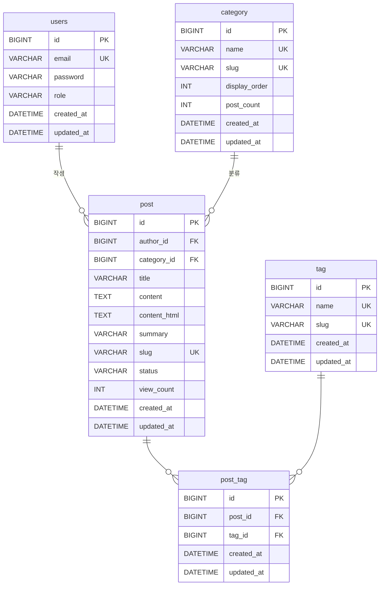

# Private Blog

개인 블로그 프로젝트입니다. Spring Boot 기반의 풀스택 웹 애플리케이션으로, 직접 설계하고 구현했습니다.

**[hgkimer.me](https://hgkimer.me)** 에서 확인하실 수 있습니다.

---

## Tech Stack

| 분류 | 기술 |
|------|------|
| **Language** | Java 17 |
| **Framework** | Spring Boot 3.5, Spring Security, Spring Data JPA |
| **Template** | Thymeleaf |
| **Database** | MySQL 8.0, Redis |
| **ORM / Migration** | Hibernate, Flyway |
| **Authentication** | JWT (jjwt), Token Rotation, Blacklist |
| **Markdown** | Flexmark |
| **Build** | Gradle (Kotlin DSL) |
| **Infra** | Docker, Docker Compose, Nginx, Certbot (Let's Encrypt) |

---

## 주요 기능

### 블로그
- 게시글 작성 / 수정 / 삭제 (Markdown 지원)
- 카테고리 및 태그 분류
- 게시글 상태 관리 (임시저장 / 발행)
- 조회수 카운트
- 키워드 검색 및 카테고리 필터링 (페이지네이션)

### 인증 / 보안
- JWT 기반 인증 (Access Token + Refresh Token)
- **Refresh Token Rotation** — 토큰 재발급 시 기존 토큰 무효화
- **Redis 기반 토큰 블랙리스트** — 로그아웃 시 즉시 무효화
- 로그인 엔드포인트 **Rate Limiting** (Nginx, Brute-Force 방어)
- HTTPS 적용 (Certbot / Let's Encrypt)
- HttpOnly + Secure 쿠키로 토큰 전달

### 인프라
- Docker Compose로 앱 + MySQL + 볼륨 통합 관리
- Nginx 리버스 프록시
- Flyway로 DB 스키마 버전 관리

---

## 아키텍처

```
Client
  │
  ▼
Nginx (443/80 → HTTPS, Rate Limit)
  │
  ▼
Spring Boot App (8080)
  ├── Controller Layer    — REST API / View Controller
  ├── Service Layer       — 비즈니스 로직
  ├── Repository Layer    — Spring Data JPA
  └── Security Layer      — JWT Filter, UserDetailsService
        │
        ├── MySQL          — 게시글, 카테고리, 태그, 유저
        └── Redis          — Refresh Token 저장 / Blacklist
```

---

## ERD



---

## 프로젝트 구조

```
private_blog/
├── src/main/java/.../
│   ├── config/            # Spring 설정 (Security, JPA, Markdown 등)
│   ├── domain/entity/     # JPA 엔티티 (Post, Category, Tag, User)
│   ├── persistence/jpa/   # Repository 인터페이스
│   ├── service/           # 비즈니스 로직
│   │   └── auth/          # JWT 발급 / 로테이션 / 블랙리스트
│   ├── security/          # JWT Filter, TokenProvider
│   └── web/
│       ├── controller/    # REST API + Thymeleaf View Controller
│       ├── dto/           # Request / Response DTO
│       └── exception/     # 전역 예외 처리
├── src/main/resources/
│   ├── db/migration/      # Flyway SQL 마이그레이션
│   ├── templates/         # Thymeleaf HTML 템플릿
│   └── static/            # CSS, 이미지
├── docker/
│   ├── Dockerfile
│   └── docker-compose.yaml
└── nginx/
    ├── hgkimer.me.conf    # nginx 설정
    └── bad_uri.conf       # 차단 uri 설정
```

---

## 실행 방법

### 1) 로컬 개발 실행 (local profile)

사전 요구사항:
- Java 17

실행:
```bash
./gradlew bootRun
```

`bootRun`은 기본적으로 `application-local.yaml` 프로파일로 실행됩니다.

### 2) Docker Compose 실행 (prod profile)

사전 요구사항:
- Java 17
- Docker & Docker Compose

실행:
```bash
# 1. 실행 가능한 JAR 생성 (build/libs/app.jar)
./gradlew bootJar

# 2. Docker 빌드 컨텍스트(docker/)로 JAR 복사
cp build/libs/app.jar docker/app.jar

# 3. 환경 변수 파일 준비
cp docker/example.env docker/.env.prod
# 필요 값 입력: DB_URL, DB_USER, DB_PASSWORD, MYSQL_ROOT_PASSWORD, MYSQL_DATABASE,
#            MYSQL_USER, MYSQL_PASSWORD, JWT_SECRET_KEY, REDIS_HOST, REDIS_PORT

# 4. 컨테이너 빌드/실행
cd docker
docker compose up -d --build
```

중지:
```bash
cd docker
docker compose down
```

---

## 구현 시 고민한 점

- **JWT Refresh Token Rotation** : Refresh Token을 Redis에 저장하고, 재발급 시 이전 토큰을 즉시 삭제하여 토큰 탈취 시 피해를 최소화했습니다.
- **조회수 이중 카운트 방지** : 게시글 조회와 카운트 상승 로직을 분리하여 중복 집계 문제를 해결했습니다.
- **Flyway 스키마 관리** : 배포 환경에서 DB 변경 이력을 추적하고 안정적인 마이그레이션을 보장합니다.
- **SameSite 쿠키 정책** : CSRF 방어를 위해 JWT를 `SameSite=Strict; Secure; HttpOnly` 쿠키로 전달합니다.
